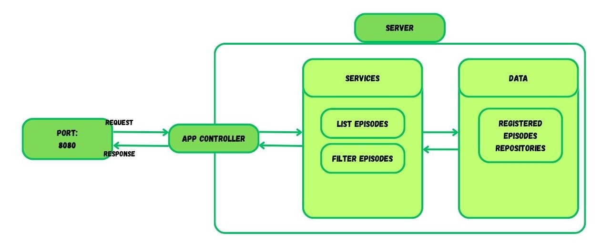

<h1 align="center">Youtube Manager O(∩_∩)O</h2>
<p align="center">
  
</p>
 
## Description
Management of videos from the Taylor Swift YouTube channel.
This application allows users to search for videos on YouTube channel Taylor Swift, filter them by name, view details, header image. It is designed to help users easily find and manage their favorite YouTube content.

## Technologies
- Node.js
- TypeScript

## Domain
Youtube videos management.

## Features
- Search for videos on YouTube.
- List videos by channel name.
- Visualize video details.

## How

### Features:
- **Search Videos**: List videos by channel name.
The API rest will return in a Json format the name of the video, the image, and the link to the video.
```js
channel: "Taylor Swift",
videos: [
    {
        title: "Anti-Hero (Behind The Scenes with The Ghosts In The Room)",
        videoId: "P0haCYjysUs",
        views: 1194921
    },
    {
        title: "Taylor Swift - Bejeweled (Official Music Video)",
        videoId: "b7QlX3yR2xs",
        views: 95222920
    },
]
```
## Software Arquiteture Idea

